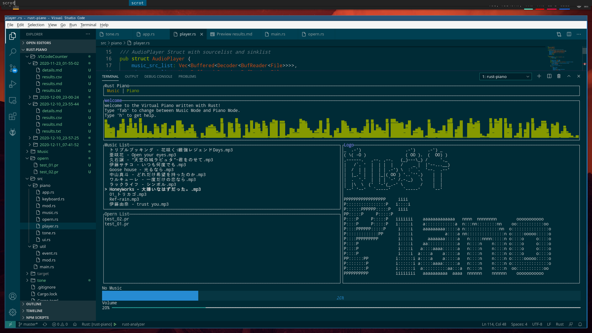
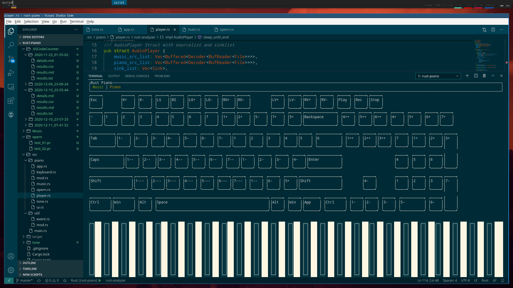

```

 _  .-')                  .-')     .-') _                 _ (`-.               ('-.          .-') _               
( \( -O )                ( OO ).  (  OO) )               ( (OO  )             ( OO ).-.     ( OO ) )              
 ,------.   ,--. ,--.   (_)---\_) /     '._             _.`     \   ,-.-')    / . --. / ,--./ ,--,'   .-'),-----. 
 |   /`. '  |  | |  |   /    _ |  |'--...__)    .-')   (__...--''   |  |OO)   | \-.  \  |   \ |  |\  ( OO'  .-.  '
 |  /  | |  |  | | .-') \  :` `.  '--.  .--'  _(  OO)   |  /  | |   |  |  \ .-'-'  |  | |    \|  | ) /   |  | |  |
 |  |_.' |  |  |_|( OO ) '..`''.)    |  |    (,------.  |  |_.' |   |  |(_/  \| |_.'  | |  .     |/  \_) |  |\|  |
 |  .  '.'  |  | | `-' /.-._)   \    |  |     '------'  |  .___.'  ,|  |_.'   |  .-.  | |  |\    |     \ |  | |  |
 |  |\  \  ('  '-'(_.-' \       /    |  |               |  |      (_|  |      |  | |  | |  | \   |      `'  '-'  '
 `--' '--'   `-----'     `-----'     `--'               `--'        `--'      `--' `--' `--'  `--'        `-----' 

```
# Rust-Piano
rust-piano is a command line keyboard piano written with `Rust` language.  
At first this project is developed for `software engineering course` in `Huazhong University of Science & Technology`.  
But I want to develop it as better Rust project.  

## Dependencies
+ [Rust-environment](https://www.rust-lang.org/tools/install)  

## Installation
```
git clone https://github.com/SKTT1Ryze/rust-piano.git
cargo run
```

## What I have done
+ music list, can play music, adjust volume and pause.  
+ simple keyboard piano need improvement
+ automatically play piano music

## Demo
  
  

## TODO
+ modify the bad code
+ add multithreading support
+ try to simplify the structure
+ add some details

