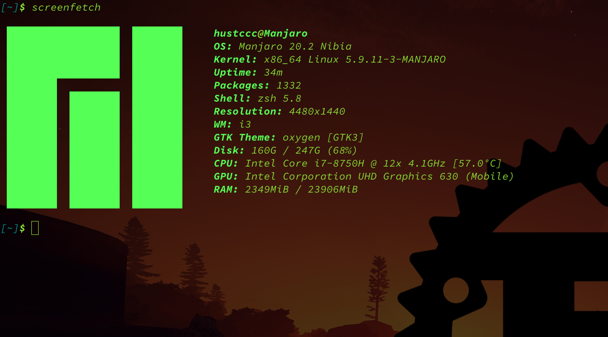

# <center>华中科技大学计算机科学与技术学院</center>  <center>软件工程项目报告</center>  <center>**Rust 语言实现的虚拟钢琴**</center>  
<center>计科校交 1801</center>  <center>车春池</center>  <center>U201816030</center>  <center>E-mail: 1276675421@qq.com</center> <center>github: https://github.com/SKTT1Ryze</center> <center>同组成员：郝凯欣 李家伟</center> <center>指导老师：</center> <center>报告日期：2020-12-14</center>

## 任务书
### 总体要求
+ 综合运用软件工程的思想，协同完成一个软件项目的开发，掌握软件工程相关的技术和方法
+ 组成小组进行选题，通过调研完成项目的需求分析，并详细说明小组成员的分工，项目的时间管理等方面
+ 根据需求分析进行总体设计，详细设计，编码与测试等

### 基本内容
根据给出的题目任选一题，自行组队，设计与开发中软件过程必须包括：  
+ 问题概述，需求分析：正确使用相关工具和方法说明所开发软件的问题定义和需求分析。
+ 原型系统设计，概要设计，详细设计：主要说明所开发软件的架构，数据结构及主要算法设计
+ 编码与测试：编码规范，运用 `github` 等平台进行版本管理，设计测试计划和测试用例
+ 功能创新：与众不同，特别吸引用户的创新
+ 用户反馈：包括用户的使用记录，照片，视频等

## 问题定义
### 项目背景及意义
钢琴是现代最为流行的乐器，但是由于价格昂贵，许多家庭买不起钢琴，这导致音乐艺术和钢琴教育的普及受到阻碍。  
为了解决这个问题，目前电脑上已经有了几款虚拟钢琴软件，用户可以在电脑上通过键盘来演奏乐曲。  
但很不幸的是这些虚拟钢琴软件大部分只能用于 Windows 操作系统，目前在 Linux 操作系统上还没有一款比较成熟稳定的虚拟钢琴软件。  
Linux 是一个开源的非常强大的操作系统，**我们希望通过制作一个在 Linux 命令行界面上运行的虚拟钢琴软件来改变这个现状**。  
`Rust` 语言是一门现代系统语言，它有很优秀的语言机制使得写出的应用十分安全，我们希望使用 `Rust` 语言来开发这款虚拟钢琴软件。  

### 项目基本目标
项目立项时希望实现以下功能：  
+ 音乐播放功能
+ 键盘发音功能：键盘上每个键对应一个音，按下键可以发出相应的钢琴音
+ 可以设置键盘整体音高
+ 输入相应格式的曲谱，虚拟钢琴可以自动演奏该曲子
+ 音游模块
+ 支持多平台（在 Linux 平台开发）


### 可行性分析
Rust 语言是一门十分优秀的现代系统编程语言，其强大的语言机制使得我们写出的应用很安全，很少 bug 或者没有 bug。  
我们在谈论一个项目实现的可行度的时候，常常会谈到“造轮子”的问题。有没有实现好的轮子或者有没有好的轮子，影响到项目的开发难度和成品质量。这就涉及到了生态的问题，现在 Java 和 Python 等编程语言为什么那么火，很大一部分原因是它们具有庞大成熟的生态，这就使得它们的使用者可以很方便地调库或者在现成的框架中进行开发，降低了项目的开发难度和减轻了开发者的工作量。  
Rust 现在已经形成了很大的社区，尽管它的生态还在成长，现在已经较为成熟，有非常可观的开源代码可以借用。**我们基于 Rust 语言开发这款虚拟钢琴软件完全不用担心“重复造轮子”的问题**。  
在初期调研中，我们发现，实现这款虚拟钢琴软件所需要的几个关键模块：  
+ 音频处理
+ 音频播放
+ 按键检测
+ TUI 界面

在 Rust 社区中都有相关的开源项目或者开源库，因此我们可以认为该项目的可行度是比较高的。  
除此之外，Rust 语言使用 Cargo 工具进行项目管理，可以实现跨平台开发。意思是，不管是 Linux 平台还是 Windows 平台，项目的搭建和编译和运行都只需要几行命令，因此**使用 Rust 语言开发本身就已经实现了多平台支持**。  

### 人员管理和项目进度管理
#### 人员管理
本项目有一个管理员，两个开发者，各自负责相应模块的工作：  
+ [hustccc](https://gitee.com/sktt1ryze/)(项目管理员，负责项目主体框架的设计，后端功能实现)
+ [haokaixin](https://gitee.com/hao-kaixin31)(项目开发者，负责音频处理，曲谱设计和解析)
+ [lijiawei](https://gitee.com/kirito_602)(项目开发者，负责 TUI 界面设计，图形渲染)

管理员除了自身的任务之外，还负责组织会议，分配任务，进度监督等工作。  
#### 项目管理
本项目使用 `Git` 版本管理工具进行项目管理，并托管在 `gitee` 网站上：https://gitee.com/sktt1ryze/hust-se-chl  
管理员除了往仓库上提交自己的代码之外，还负责项目仓库的维护与管理，包括 `README` 的编写和更新，处理同组开发者的 `pull request`，发布 `release` 等等。  
开发者主要负责代码的编写和项目功能的实现，其提交的代码经过管理员的审批之后合并到主分支中。  

## 需求分析
### Need
+ 钢琴是现代最为流行的乐器，但是由于价格昂贵，许多家庭买不起钢琴，这导致音乐艺术和钢琴教育的普及受到阻碍。  
+ 目前的虚拟钢琴软件大部分只能用于 Windows 操作系统，目前在 Linux 操作系统上还没有一款比较成熟稳定的虚拟钢琴软件。    

### Benefit
+ Linux 用户狂喜（滑稽）。
+ Linux 用户中的音乐爱好者将会有一款支持原生 Linux 平台的 虚拟钢琴软件，他们可以省下买钢琴的金钱或者不必切换到 Windows 去弹琴了。
+ 其次是对 Linux 开源社区还有 Rust 社区来说它们又多了一份开源项目，为开源生态做了贡献。  

## 概要设计和详细设计
### Rust 语言简介
Rust 是由 Mozilla 主导开发的通用、编译型编程语言。设计准则为“安全、并发、实用”，支持函数式、並行式、程序式以及面向对象的编程风格。  
Rust 语言的本质在于 `赋能`，无论你现在编写的是何种代码，Rust 能让你在更为广泛的编程领域走得更远。  
比如 `系统层面` 的工作，涉及内存管理，数据表示和并发等底层细节。从传统角度来看，这是一个神秘的编程领域，只为浸淫多年的极少数人所触及，也只有他们能避开那些臭名昭著的陷阱。即使再谨慎的实践者，亦唯恐代码出现漏洞，崩溃或损坏。  
Rust 破除了这些障碍，它通过所有权机制和生命周期和其他一些语言特性消除了旧的陷阱并提供了伴你一路同行的友好，精良的工具。想要深入底层控制的程序员可以使用 Rust，无需冒着常见的崩溃或安全漏洞的风险，也无需学习时常改变的工具链的最新知识，其语言本身更是被设计为自然而然的引导你编写出在运行速度和內存使用上都十分高效的可靠代码。  
Rust 并不局限于底层系统编程，其表现力和工效足于令人愉悦地写出 CLI 应用， web server 和很多其他类型的代码。  
### **Rust 所有权**
Rust 的核心功能（之一）是`所有权`（ownership）。虽然该功能很容易解释，但它对语言的其他部分有着深刻的影响。  
所有权的规则如下：  
+ Rust 中的每一个值都有一个被称为其`所有者`(owner)的变量
+ 值在任一时刻有且只有一个所有者
+ 当所有者（变量）离开作用域，这个值将被丢弃

**`所有权`贯穿 Rust 代码的每个角落，Rust 代码通过它实现了`内存安全`。**  
所有运行的程序都必须管理其使用计算机内存的方式。一些语言中具有垃圾回收机制，在程序运行时不断地寻找不再使用的内存；在另一些语言中，程序员必须亲自分配和释放内存。Rust 则选择了第三种方式：通过所有权系统管理内存，编译器在编译时会根据一系列的规则进行检查。在运行时，所有权系统的任何功能都不会减慢程序。  

### Rust 项目管理
Rust 语言使用 `Cargo` 工具来管理项目。  
创建一个新的 Rust 项目：  
```
cargo new --bin rust-project
```

如果你想开发一个 Rust 库，可以想这样创建一个 `Rust Crate` 项目：  
```
cargo new --lib rust-lib
```

进入到 Rust 项目目录，你可以这样编译 Rust 代码：  
```
cargo build
```

如果你想要编译并且运行的话，可以运行以下命令：  
```
cargo run
```

当然，如果你是在开发一个 Rust 库，`cargo run` 将不起作用。  

最后你可以运行以下命令来清理你的 Rust 项目：  
```
cargo clean
```

### Rust Crate
我们在项目开发的时候，往往会进行一项操作，那就是“调库”或者说“调包”，这是软件开发者在使用别人写好的代码的时候最常用的一种方式。而不同的编程语言调库的方式不同，有些编程语言比如 C 或 C++ 在调库的时候相对麻烦，你需要加上相关的头文件还需要在 `Makefile` 中添加相应的编译选项。这种调库方式在写小型项目的时候可能还可以接受，但一旦到了开发较为复杂项目的时候一般的程序开发者可能就吃不消了，每个源文件之间都相互有依赖关系，这时候要想往项目里面增加一个源文件或者减少一个，就会一发而动全身，导致整个项目无法编译。  
现代的编程语言为了解决这个问题一般都会有相关的调包语法，比如 Python 和 Java 的 `import` 语法。这样一来开发者调用别人写的代码就变得很简单，仅仅一行代码就能实现。这样的开发模式同时也能促进编程语言生态的发展，因为它减少了开发者的工作量。  
Rust 语言当然也有着相应的机制来调用开源代码，但是它的方式和上述的 `import` 不太一样。  
首先我们一般把一个 Rust 库称为一个 `Crate`，中文是`集装箱`的意思。  
我们之前说到新建一个 Rust 项目可以使用以下命令：  
```
cargo new --bin rust-project
```
这行命令会自动在当前目录下生成一个 `rust-project` 文件夹，而这个文件夹里面已经帮我们搭建好了目录结构，里面有个 `Cargo.toml` 文件，我们通过这个文件来管理项目相关信息和所依赖的包。刚刚新建的项目里面 `Cargo.toml` 文件大概是长这样：  
```
[package]
name = "rust-project"
version = "0.1.0"
authors = ["your-email@email.com"]
edition = "2018"

# See more keys and their definitions at https://doc.rust-lang.org/cargo/reference/manifest.html

[dependencies]

```

如果我们想要调用一个 Rust Crate，我们只需要在这个文件的 `[dependencies]` 下面添加即可，比如我们添加一个用于生成随机数的 Crate `rand`，我们可以这样写：  
```
[dependencies]
rand = "0.7.3"
``` 
其中 `0.7.3` 是版本号。  
然后我们就可以在源代码中这样调用这个 `rand` 库：  
```Rust
use rand::xx;
```
除此之外如果我们创建项目的时候加上了 `--lib` 参数：  
```
cargo new --lib rust-lib
```
那么我们开发的这个库就是一个 Crate，可以被其他的 Rust 代码调用。  
Rust 语言的开发者希望通过这种方式提高项目开发的效率，更加地改善 Rust 生态。我个人觉得 Rust 语言这种开发模式是比较好的，而且在我接触过的编程语言中是最舒服的。  

### Rodio Crate
`Rodio` 是一个用 Rust 语言实现的音频播放库，在 `github` 上开源并且已经发布到了 `crate.io` 中：https://github.com/RustAudio/rodio  
`Rodio` 库一个重要的概念是 `Source Trait`（`Trait` 是 Rust 一个语言特性，由于比较复杂，这里不多进行阐述），它表示一个`音源`，并且可以是流媒体。  
使用该库播放音频需要下面三个步骤：  
+ 创建一个代表流音频的对象，可以是正弦波，缓冲器或者音频解码器，还可以是自定义的实现了 `Source Trait` 的对象。
+ 选择一个音频输出设备（可以默认）
+ 调用 `play_raw` 播放原始音频

`Rodio` 为了方便控制音频的播放，提供了一个 `Sink` 类型，每个 `Sink` 代表一个音轨，可以通过向 `Sink` 中添加音源来进行播放。  
`Source Trait` 还提供了不同的过滤器 `Filters`。  
下面简单讲下 `Rodio` 的工作原理：  
`Rodio` 产生一个后台线程，专用于从音源中读取音频数据并将数据发送到音频输出设备。每当放弃对 `Source` 的`所有权` 以进行播放时，音频流数据都会被发送到此后台线程，`Rodio` 将在该后台线程中读取它。  
所有音频都将由 `Rodio` 混合在一起，然后再发送到操作系统或硬件。因此，对同时播放的声音数量或可以创建的 `Sink` 数量没有限制（除非创建过多的 `Sink` 会降低程序速度）。  

### Tui-rs Crate
`TUI`，全称是`Ternimal User Interface`，相对于 `GUI`，`Graphics User Interface`。  
相比于 `GUI`，`TUI` 是在终端里面渲染界面，并且是通过字符来渲染，因此需要的 CPU 开销较小，更为轻量，而且界面简洁。  
Rust 社区恰好有个 `tui Crate`，我们可以通过在 `Cargo.toml` 文件中添加以下几行来添加 `tui` 作为项目的依赖：  
```
[dependencies]
tui = "0.10"
termion = "1.5"
```
#### 创建一个 `Terminal`
在使用 `tui` 渲染 TUI 界面之前，我们需要初始化一个 `Terminal`：  
```
use std::io;
use tui::Terminal;
use tui::backend::TermionBackend;
use termion::raw::IntoRawMode;

fn main() -> Result<(), io::Error> {
    let stdout = io::stdout().into_raw_mode()?;
    let backend = TermionBackend::new(stdout);
    let mut terminal = Terminal::new(backend)?;
    Ok(())
}
```

#### 创建一个用户交互界面
```
use std::io;
use termion::raw::IntoRawMode;
use tui::Terminal;
use tui::backend::TermionBackend;
use tui::widgets::{Widget, Block, Borders};
use tui::layout::{Layout, Constraint, Direction};

fn main() -> Result<(), io::Error> {
    let stdout = io::stdout().into_raw_mode()?;
    let backend = TermionBackend::new(stdout);
    let mut terminal = Terminal::new(backend)?;
    terminal.draw(|f| {
        let size = f.size();
        let block = Block::default()
            .title("Block")
            .borders(Borders::ALL);
        f.render_widget(block, size);
    })
}
```


### 项目总体架构
#### MindMap
```mermaid
graph TD;
    Source-->Music;
    Source-->Tone;
    Music-->AudioPlayer;
    Tone-->Opern;
    Key-->PKey;
    Tone-->PKey;
    PKey-->KeyBoard;
    AudioPlayer-->App;
    Tone-->App;
    KeyBoard-->App;
    Opern-->App;
    Other-->App;
    App-->TUI Render;
```

#### App
`App` 数据结构是整个项目信息，包括运行时和静态编译期的信息的集合，其中比较重要的几个成员分别是：  
+ music_list：`Music` 的集合，用于构建音乐播放列表
+ audio_player：`AudioPlayer` 的实例，负责音频的播放
+ tones：`Tone` 琴音的集合，结合 `audio_player` 和 `keyboard` 构建键盘钢琴
+ keyboard：`KeyBoard` 的实例，键盘的抽象，结合 `audio_player` 和 `tones` 构建键盘钢琴
+ operns：`Opern` 的集合，负责收集曲谱

#### TUI Render
`TUI Render` 主要是通过 `tui Crate` 里的库函数结合 `App` 中的信息来渲染 TUI 界面，没有单独的数据结构，以函数的形式工作。  
`TUI Render` 的代码集中在 `src/ui.rs` 文件里。  

#### Music
`Music` 是抽象一首`音乐`的数据结构：  
```Rust
pub struct Music 
{
    path: String,   // 音乐 mp3 文件路径
    name: String,   // 音乐名
    source: Buffered<Decoder<BufReader<File>>>, // 从音乐文件中提取出的 `Source`
    pub duration: Duration, // 音乐时长，用于显示进度条
}
```

成员函数有：  
```Rust
pub fn new(path: &str) -> Result<Music, ()> // 新建一个 `Music` 实例
pub fn get_source(&self) -> Buffered<Decoder<BufReader<File>>>  // 返回这个 `Music` 的 `Source`
pub fn name(&self) -> &str  // 返回这个 `Music` 的 `name`
```

#### AudioPlayer
`AudioPlayer` 是抽象一个`音频播放器`的数据结构：  
```Rust
/// AudioPlayer Struct with sourcelist and sinklist
pub struct AudioPlayer {
    music_src_list: Vec<Buffered<Decoder<BufReader<File>>>>, // 音乐列表
    piano_src_list: Vec<Buffered<Decoder<BufReader<File>>>>, // 钢琴音列表
    sink_list: Vec<Sink>,   // Sink 音轨列表
    output_stream: (OutputStream, OutputStreamHandle),  // 输出流
    pre_time: Instant,  // 之前播放的时间，用于显示进度条
    progress: f64,  // 音乐播放进度，用于显示进度条
    tone_sink: usize,   // 用于播放琴音的 Sink 音轨索引
}
```

成员函数有：  
```Rust
pub fn new(sink_num: usize) -> Result<Self, ()> // 新建一个 `AudioPlayer` 实例
pub fn append_music(&mut self, source: Buffered<Decoder<BufReader<File>>>)  // 往音乐源列表里面添加实例
pub fn append_tone(&mut self, source: Buffered<Decoder<BufReader<File>>>)   // 往琴音列表里面添加实例
pub fn music2sink(&mut self)    // 将音乐列表中的 `Source` 全都 push 进第 0 个 `Sink` 音轨
pub fn tone2sink(&mut self) // 将琴音列表中的 `Source` 全都 push 进第一个到最后一个 `Sink` 音轨
pub fn play_music(&mut self) // 播放音乐
pub fn play_tone(&mut self) // 播放琴音
...... // 其余省略

```
`AudioPlayer` 管理着整个项目中的音频处理和播放。  

#### Events Handle
本项目中的 `Events Handle` 主要是键盘事件的检测和处理。  
这部分代码主要是在 `main.rs` 文件里面：  
```Rust
let events = Events::with_config(Config {
        tick_rate: Duration::from_millis(cli.tick_rate),
        ..Config::default()
    });

......

loop {
        match events.next()? {
            Event::Input(key) => {
                app.handle_key_input(key);
            },
            Event::Tick => {
                app.on_tick();
            }
        }
        if app.should_quit {
            break;
        }
    }
```

程序在一个无限循环里面，不断检测键盘事件的发生，并进入到相应的处理函数去处理，这里主要是进入到 `App` 结构的成员函数中进行处理。  

#### KeyBoard
`KeyBoard` 数据结构是对键盘的抽象，在这之前我定义了一个 `PKey` 数据结构来对键盘中一个键进行抽象：  
```Rust
pub struct PKey<'a> {
    pub key: Key,   // 键对应的 `Key`，程序中通过这个来区分不同的键盘键
    pub tone_name: Option<&'a str>, // 该键对应的 `Tone` 琴音名
    pub pressed: bool,  // 该键是否被按下
}
```
然后 `KeyBoard` 数据结构就很简单了，单纯是 `PKey` 的集合：  
```Rust
pub struct KeyBoard<'a> {
    keys: Vec<Vec<PKey<'a>>>,
}
```

#### Tone & Opern
`Tone` 是对一个琴音的抽象，`Opern` 是对一张曲谱的抽象，从设计思路上，`Tone` 是 `Opern` 的一部分。  
```Rust
#[derive(Clone)]
pub struct Tone {
    pub name: String,
    pub source: Buffered<Decoder<BufReader<File>>>,    
}

pub struct Opern {
    path: String,
    beats: Vec<Option<Buffered<Decoder<BufReader<File>>>>>,
    ptr: usize,
    counter: usize,
}
```

## 实现与测试
### 实现环境与代码管理
开发环境使用 Linux 发行版 `Manjaro` 系统：  
  

代码管理使用 `Cargo` 和 `Git` 工具：  
```
cargo 1.47.0 (f3c7e066a 2020-08-28)
git version 2.29.2
```

### 测试计划和测试用例
Edsger W. Dijkstra 在其 1972 年的文章【谦卑的程序员】（“The Humble Programmer”）中说到 “软件测试是证明 bug 存在的有效方法，而证明其不存在时则显得令人绝望的不足。”（“Program testing can be a very effective way to show the presence of bugs, but it is hopelessly inadequate for showing their absence.”）这并不意味着我们不该尽可能地测试软件！  
程序的正确性意味着代码如我们期望的那样运行。Rust 是一个相当注重正确性的编程语言，不过正确性是一个难以证明的复杂主题。Rust 的`类型系统`在此问题上下了很大的功夫，不过它不可能捕获所有种类的错误。为此，Rust 也在语言本身包含了编写软件测试的支持。  
这种测试框架我们称之为`单元测试`。  

#### Rust 项目单元测试
Rust 中的测试函数是用来验证非测试代码是否按照期望的方式运行的。测试函数体通常执行如下三种操作：  
+ 设置任何所需的数据或状态
+ 运行需要测试的代码
+ 断言其结果是我们所期望的

为了将一个函数变成测试函数，需要在 `fn` 行之前加上 `#[test]`，像这样：  
```Rust
#[cfg(test)]
mod tests {
    #[test]
    fn it_works() {
        assert_eq!(2 + 2, 4);
    }
}
```
当使用 `cargo test` 命令运行测试时，Rust 会构建一个测试执行程序用来调用标记了 `test` 属性的函数，并报告每一个测试是通过还是失败，终端输出结果大体上像下面这样：  
```
running 1 test
test tests::it_works ... ok

test result: ok. 1 passed; 0 failed; 0 ignored; 0 measured; 0 filtered out

   Doc-tests adder

running 0 tests

test result: ok. 0 passed; 0 failed; 0 ignored; 0 measured; 0 filtered out
```

这是 Rust 语言为开发者提供的测试支持，它还有很多其他强大的功能，比如自定义错误信息，文档测试等等。本项目将会充分利用 Rust 中的这个单元测试框架来对我们写的项目进行测试。  

#### 单元测试用例
本项目中测试覆盖率达到了 70%，基本上每个源代码文件都有相应的单元测试，这里只展示其中的一个，更加具体的测试内容请阅读源码：  
```Rust
#[test]
fn test_music() {
    let path = "Music/Ref-rain.mp3";
    let music = Music::new(path).unwrap();
    assert_eq!(music.path, "Music/Ref-rain.mp3");
    assert_eq!(music.name(), "Ref-rain.mp3");
}
```

### 结果分析
在项目目录下运行 `cargo test` 命令，终端中输出以下结果：  
```
running 8 test
test piano::music::test_music ... ok
test piano::keyboard::test_keyboard ... ok
test piano::keyboard::test_pkey ... ok
test piano::player::test_player ... ok
test piano::tone::test_tone ... ok
test piano::opern::test_opern ... ok
test piano::ui::test_tui ... ok
test piano::app::test_app ... ok

test result: ok. 8 passed; 0 failed; 0 ignored; 0 measured; 0 filtered out
```

## 项目总结
### 用户反馈
### 总结

## 体会